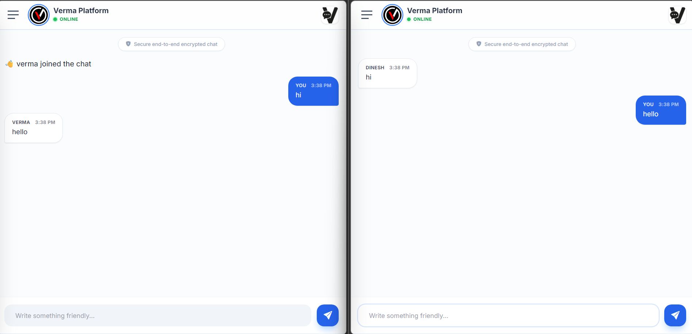
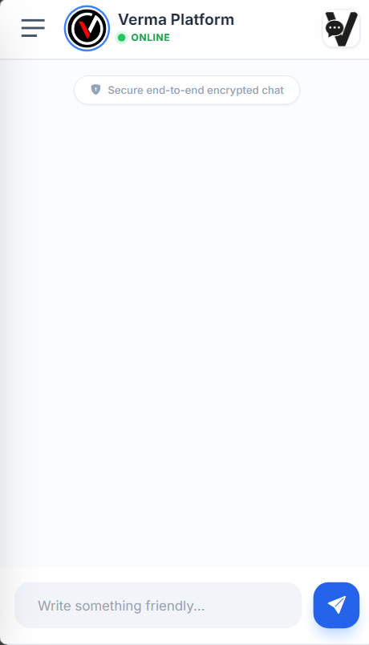
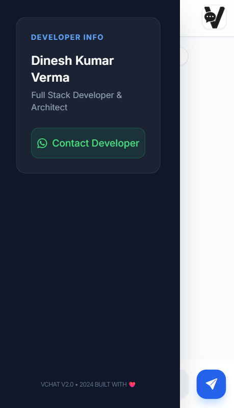

# 💬 VChat – Real-Time Group Chat Application

VChat is a professional real-time web chat application built using Node.js, Express, and Socket.io.  
It enables multiple users to join a shared chat room and communicate instantly.

---
# 💬 VChat – Real-Time Group Chat Application

VChat is a modern real-time web chat application built using **Node.js, Express, and Socket.io**.  
It allows multiple users to connect and chat instantly in a shared environment.

---

## 🌐 Live Preview

🚀 **Live Demo:**  
👉 https://vchat-dzo1.onrender.com/

---

## 🖼️ Application Preview


## 🖼️ Application Preview in (mobile phone)

<p align="center" >
  
  
</p>

---

## ✨ Features

- 🔴 Real-time messaging using WebSockets  
- 👥 Multiple users can join  
- ⌨️ Typing indicator  
- 👋 User join & leave notifications  
- 👑 Admin login system  
- 🎨 Professional responsive UI (Tailwind CSS)  
- 📱 Mobile-friendly design  

---

## 🏗️ How It Works

VChat follows a real-time client-server architecture:

## 🚀 Overview

VChat is a browser-based group chat system where:

- Multiple users can join simultaneously
- Messages are delivered in real time
- Users can see when someone joins or leaves
- Typing indicators are shown
- Admin login is supported
- Chat becomes active only when more than one user is online

---

## 🏗️ How It Works

### 1️⃣ Client–Server Architecture

VChat follows a real-time client-server model:

User Browser → Server → Other Users

Messages never go directly from one browser to another.  
All communication passes through the server.

---

### 2️⃣ When a User Joins

- User opens the website
- User enters a name
- The browser connects to the server using Socket.io
- The server registers the user
- If at least 2 users are connected, chatting is enabled

If only one user is online:
- The system waits for another user before allowing real conversation

---

### 3️⃣ Sending Messages

When a user sends a message:

1. The message is sent to the server
2. The server broadcasts it to all other connected users
3. The sender sees the message on the right side
4. Other users see the message on the left side

This happens instantly using WebSockets.

---

### 4️⃣ User Events

The application handles the following events:

- 👋 User Joined  
- 🚪 User Left  
- 💬 Message Sent  
- ⌨️ User Typing  
- 👑 Admin Login  

---

### 5️⃣ Admin Access

There is a protected admin login:

- Special username and password required
- Admin receives a welcome message
- Identified differently on the server

---

## 🎨 Frontend Features

The frontend is built using:

- Tailwind CSS (modern UI design)
- Bootstrap Icons
- Google Fonts (Inter)
- jQuery
- Socket.io client library

UI Features:

- Responsive design
- Sidebar with developer info
- Online status indicator
- Typing indicator
- Smooth message animations
- Professional chat layout

---

## 🖥️ Backend Features

Built with:

- Node.js
- Express
- Socket.io

Backend Responsibilities:

- Manage user connections
- Track active users
- Control chat activation (minimum 2 users)
- Broadcast messages
- Handle disconnections
- Manage admin login logic

---

## 🔐 Chat Activation Logic

Chat only works when:

Active Users > 1

If only one user is connected:
- Messages are blocked
- User must wait for someone else to join

This ensures real-time interaction between actual participants.

---

## 🌐 Deployment

The application can be deployed on platforms like:

- Render
- Railway
- Heroku (legacy)
- Any VPS supporting Node.js

Make sure:
- Server uses process.env.PORT
- "start" script is defined in package.json

---

## 📂 Project Structure
/project-root
│
├── index.js # Backend server
├── package.json # Dependencies & scripts
├── /public
│ ├── index.html # Main UI
│ ├── js/client.js # Frontend logic
│ └── assets
│
└── README.md


---

## 🧠 Real-Time Communication Technology

VChat uses WebSockets via Socket.io.

Benefits:

- Instant message delivery
- Persistent connection
- Low latency communication
- Bi-directional data flow

---

## 📌 Version

VChat v2.0  
Built in 2024  

Developer: Dinesh Kumar Verma

---

## ❤️ Future Improvements

- Private chat rooms
- File sharing
- Authentication system
- Database message storage
- Online user list
- Message encryption upgrade
- Dark mode toggle

---

## 📜 License

ISC License

## ✅ Quick One-Line Setup (All Steps Together)
Follow the steps below to clone and run VChat locally.

### 1️⃣ Clone the Repository

```bash
git clone https://github.com/Verma1235/VChat.git

cd VChat

npm install

npm start

node index.js